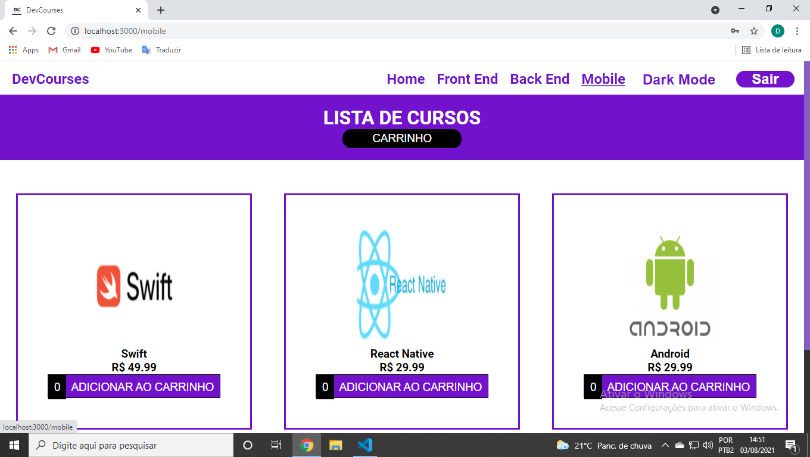

# Dev-Courses
# E-commerce de  cursos para desenvolvedores front-end, mobile e back-end.

# Tecnologias utilizadas foram # React + # Styled Components + # Redux + # Firebase + # Particles + #React Elastic Carousel + # Formik

 
 

